# Weaving gradual types into legacy codebases

## Introduction

In computer science, a type system serves as a structured framework comprised 
of a set of regulations aimed at attributing a characteristic known as a type to various 
components—be it variables, expressions, functions, or modules—that constitute a computer 
program. Its primary objective lies in mitigating the occurrence of errors within computer 
programs by establishing cohesive interfaces among disparate segments and subsequently verifying 
the consistency of their connections. Virtually all contemporary programming languages incorporate 
some form of a type system, with Assembly being a notable exception where the concept of 
type is absent. Typically, type systems are delineated within programming language specifications 
and integrated into interpreters and compilers, although there exist supplementary tools capable 
of extending a language's native type system through additional checks utilizing the language's 
inherent type syntax and structure. The principal aim of a programming language's type system 
is to curtail potential sources of errors in computer programs stemming from type discrepancies. 
Examples of such errors include concatenating a string with an integer, supplying an integer to 
a function expecting a string, or accessing an invalid memory location.

Type systems can be broadly categorized into two distinct classes: static and dynamic. Also, referred
to as statically typed or dynamically typed languages, these classes differ in their approach to type 
checking. In statically typed languages, type checking is performed at compile time, thereby ensuring
that type errors are detected before the program is executed. Conversely, dynamically typed languages
defer type checking until runtime, allowing for more flexibility in the program's structure and behavior.
These two paradigms are not mutually exclusive, and many programming languages incorporate elements of
both static and dynamic typing. In a dynamically typed language, the type information is associated with
values rather than variables, and in a statically typed language, the type information is associated with
variables rather than values. The dichotomy between static and dynamic typing continues to shape modern 
programming discouse, offering developers a spectrum of tools to balance safety, performance, and ease 
of use based on their specific needs.

## Towards statically typed languages

In recent years, there has beed a trend across the ecosystem towards increasingly statically typed languages.
JavaScript, a dynamically typed language is the de facto standard for web development and has seen wide spread
adoption, so much so that the term Atwoods' Law was coined to describe the phenomenon. Atwoods' Law states that
"any application that can be written in JavaScript, will eventually be written in JavaScript". But as developers 
and organizations have scaled their codebases, the lack of a strong type system has become a bottleneck. Microsoft
in 2012 released a new language called TypeScript, which is a superset of JavaScript that adds optional static
typing. TypeScript saw rapid adoption and has become the standard for large scale JavaScript development. In 2015,
with version 3.15 Python, another popular dynamically typed language, introduced type hints, which allow developers
to add type annotations to their code. There were clear signals for a desire and need for static typing as large
dynamic codebases became harder to maintain and scale. As of the Stack Overflow Developer Survey 2024, the most 
loved langauge remains Rust, which is a statically typed systems programming language that guarantees memory safety
and a rich type system. The trend towards static typing is clear. But we also saw the rise of a hybrid paradigm
that aimed to combine the best of the both worlds. Gradual typing takes a pragmatic approach to type systems by
allowing developers to add type informations for certain variables and expressions which is checked at compile time
while allowing some parts of the codebase to remain untyped. 

## How do we type gradually?

There are several approaches to gradual typing. The first approach is what we'll refer to as the transpiler approach.
This is what TypeScript does. TypeScipt is a superset of JavaScript, which means that any valid JavaScript code is
valid TypeScript code (not vice versa). Developes write code in TypeScript with type annotations and then run the
TypeScript Compiler (or tsc) to transpile the TypeScript code to JavaScript and check for type errors. The produced
JavaScript has no notion of types. But, we can rest assured that the produced JavaScript is type safe. This removal
of types is called type erasure and occurs for statically typed languages as well when the code is compiled to machine
code. 

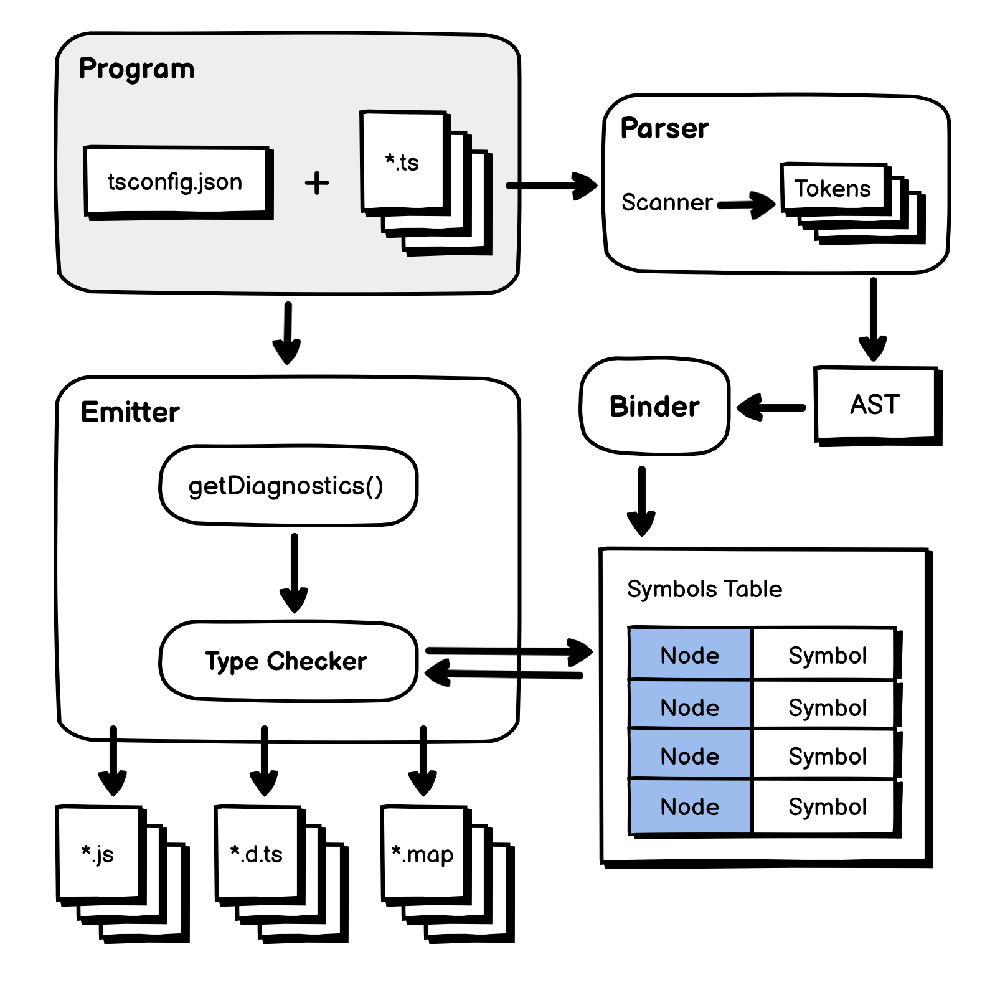
*Fig 1: Showing how the Type Script Compiler is architectured.*

The second approach we will dub as the syntactic sugar approach. This is what Python does. Python introduced type hints
which are changes to the syntax of the language that allow developers to add type annotations to their code. Python chose
to break backwards compatibility by introducing a new syntax for type hints where as TypeScript chose to be a superset of
JavaScript and make no syntax changes to JavaScript itself. The Python interpreter interestingly enough does not check
for type errors. Instead, the type hints are used by static analysis tools like mypy or pyre to check for type errors.

There exists more approaches to gradual typing, but these two are the most common and for our case illustrates the major
differences in how gradual typing can be implemented. So, to add types to an untyped code base either a) requires making a 
new language or b) requires new syntax to the language, or c) what typescript does again. Let me explain. There exists a way
to add types to JavaScript and use the TypeScript Compiler to check for type errors. @ts-docs is a tool that allows developers
to add type information in comments in their JavaScript codebase and feed this to the TypeScript Compiler to check for type
errors. This is a very interesting approach as it allows developers to add types to their codebase without changing the
syntax of the language or creating a super set (granted in this case the super set already exists whose type checking we are 
utilising for this approach). Comments in code are meant for developers and are ignored by the interpreter or compiler. Thus, 
comments carry no syntax of their own, and to add syntactically correct comments can be awkward and cumbersome. Afterall, no
programmer wants to see the compiler shout at them for an incorrectly written comment. 

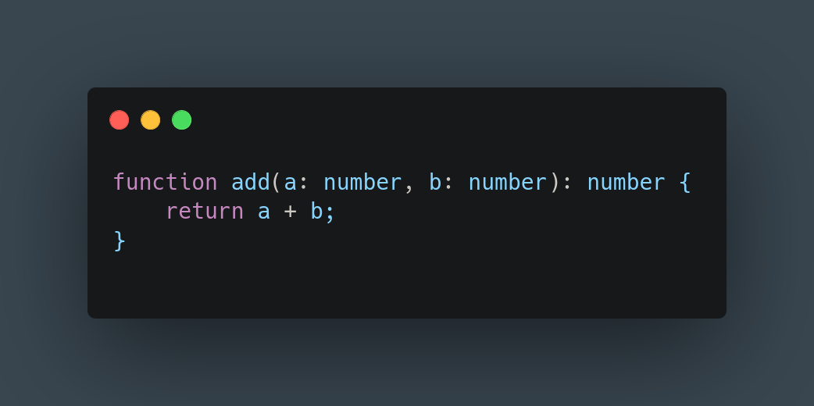
*Fig 2: This figure shows a simple TypeScript code snippet with type annotations.*

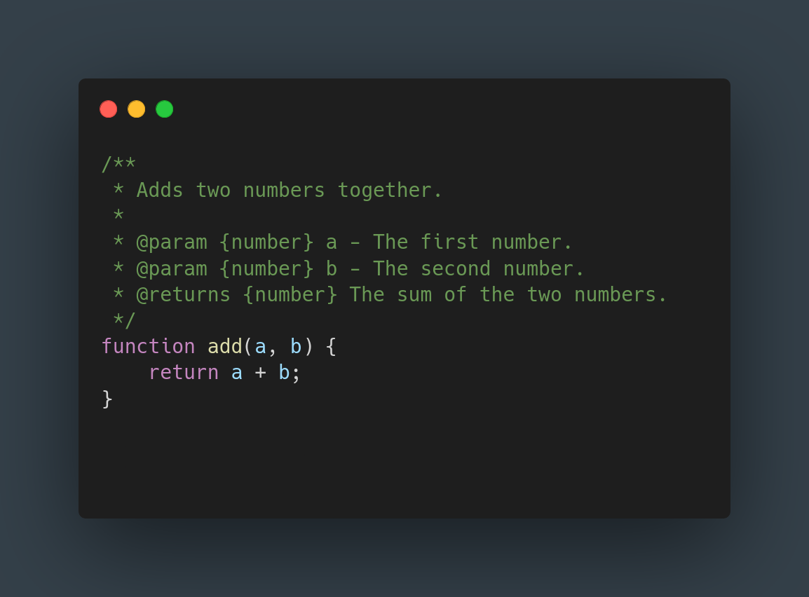
*Fig 3: This figure shows a simple JavaScript code snippet with @ts-docs type annotations.*

For out proposed solution we will keep the aforementioned three approaches in mind and their respective trade-offs.
- The need for new syntax
- The need for unobtrusive type annotations

## Terminologies

- Decidability
A type system is said to be decidable if there exists an algorithm that can determine, for any given program and 
within finite time, whether the program is well-typed according to the rules of the type system. In other words,
the type checker will terminate.

- Soundness
A type system is sound if any program that is deemed well-typed (i.e., it type-checks successfully) will not produce 
type errors when run. This ensures that the static type-checking phase (compile-time) guarantees the absence of 
certain kinds of runtime errors related to types.

An ideal type system must be both sound and decidable. Many modern type systems eventually become Turing complete and 
as a consequence undecidable. And many type systems are unsound, meaning that a program that type checks may still
produce type errors at runtime.

## How is TypeLoom implemented?

Taking inspiration from modern Integrated Development Environments (IDEs) and the @ts-docs approach, we propose a new
tool called TypeLoom. This tool utitlises the Language Server Protocol (LSP) which is a protocol used by the IDE to talk
to a language server to provide features like: diagnostics, completions, and other language features. 

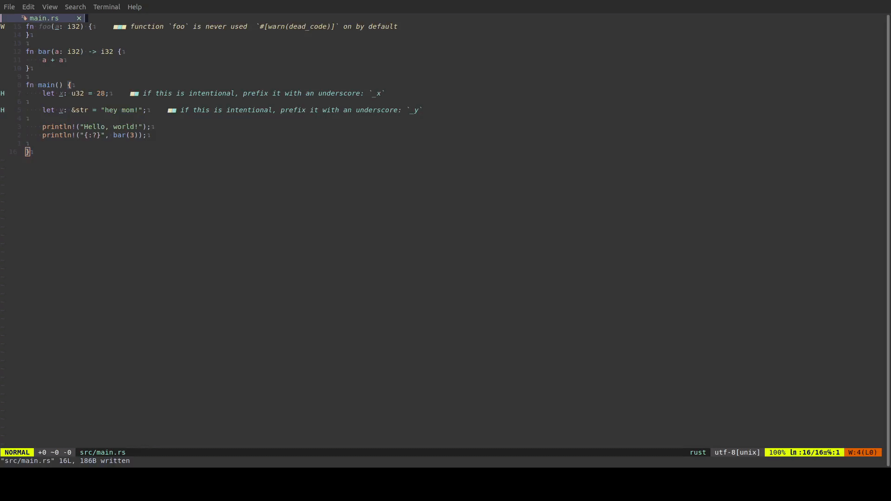
*Fig 4: Showing the features of an editor that uses the Language Server Protocol.*

TypeLoom leverages the inlay hints feature introduced in the LSP version 3.17.0. Inlay hints are a way to display additional
information in the editor without changing the source code. Language servers like Rust's rust-analyzer use inlay hints to show
type information, function signatures, and other useful information in the editor. TypeLoom will show the type information of
variables and expressions in the editor using inlay hints. To obtain the type information, TypeLoom will utilise Code Actions, 
another feature of the LSP introduced in version 3.16.0. This sets TypeLoom's first limitation, it will only work with editors
that support LSP version 3.17.0 and above. As of the time of writing, TypeLoom has only been tested with Neovim version 10.0.0.  

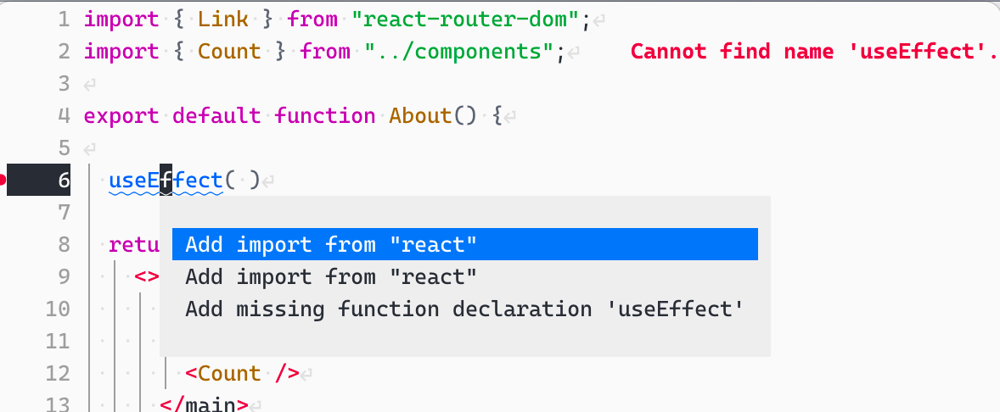
*Fig 5: This figure shows a simple code snippet with a code actions menu.*

As for what language the proposed solution will work on is Suneido. Suneido is a dynamically typed language. I have worked with 
Suneido previously in a professional capacity and have contributed to it's open source compiler and runtime. So, I have a minimal
understanding of the language and it's codebase as compared to other compilers and interpreters. The Suneido compiler is written
using the Go language. The compiler we will hereby refer to as gSuneido. TypeLoom takes the source code when opened in an editor
and sends it to gSuneido which then returns the s-expression form of the code. 

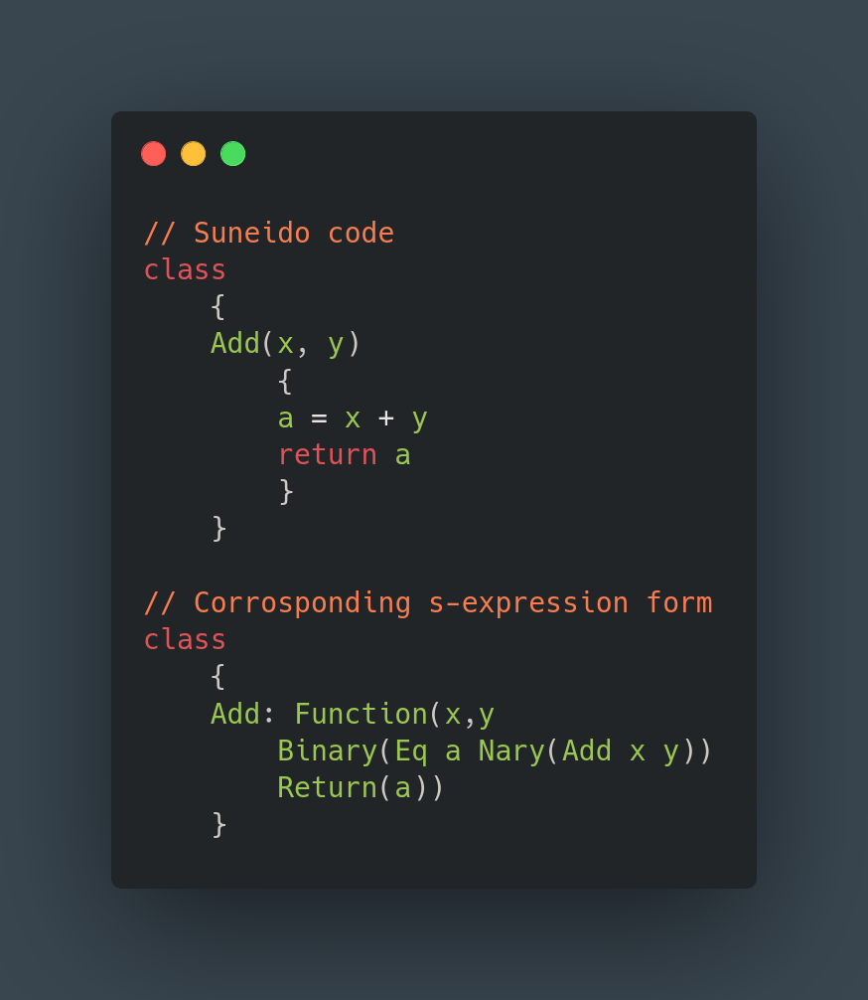
*Fig 6: This figure shows a simple code snippet in s-expression form.*

The s-expression format is simple, easy to parse and perfectly represented in a tree like structure. This makes it easy to
traverse and extract the necessary information. The s-expression form returned from the gSuneido compiler is then sent to the loom-compiler.
The loom-compiler is written in Rust, where representing a tree like structure is challenging due to the borrow checker and 
involves the `Rc<RefCell<T>>` pattern. The TypeLoom system was initially written in Python and again for a second time to support
more features, but I decided to rewrite it in Rust, as I liked the expressiveness of the type system and the borrow checker. Representing
a graph is also similary awkward with Rust's guarantess but an index based graph data structure was used to represent the graph.

The loom-compiler instead of generating an Abstract Syntax Tree (AST) generates bytecode. The bytecode contains instructions on how
to generate the graph data structure that will be used to check and infer types. The approach of using bytecode instead of AST
was inspired by the sqlite database engine. 
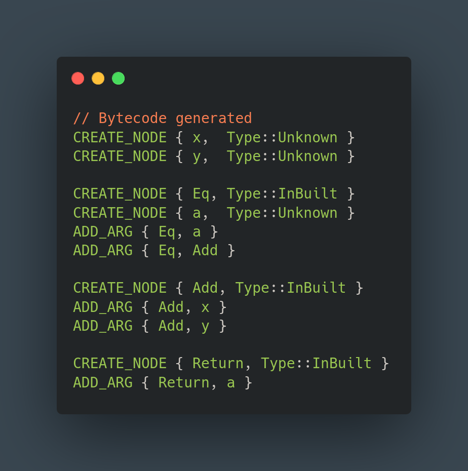
*Fig 7: This figure shows a simple code snippet in bytecode form.*

As is illustrated in the figure above, there are two bytecode instructions: CREATE and ADD_ARG. The CREATE instruction creates a new
node and takes in one argument, the name of the node created. The ADD_ARG instruction adds the second node passed to it as an argument
of the first node. For the simple expression `a = x + y`, the s-expression form would be `Eq(a, Add(x, y))`. The arguments to the Add
node are the variables x and y, while the arguments to the Eq node are the variable a and the (result of) Add node. A graph in computer
science is a data structure that is made of nodes and edges. A map of the london metro system is a graph. The nodes are the stations
and the edges are the dfferent lines that connect the stations. 

A Virtual Machine which is an extension of the loom-compiler then executes the bytecode step by step to generate the graph data strucutre. 
A module called Ceph manages the graph data structure and is responsible for checking and inferring types. Following is the full architecture
diagram of TypeLoom.
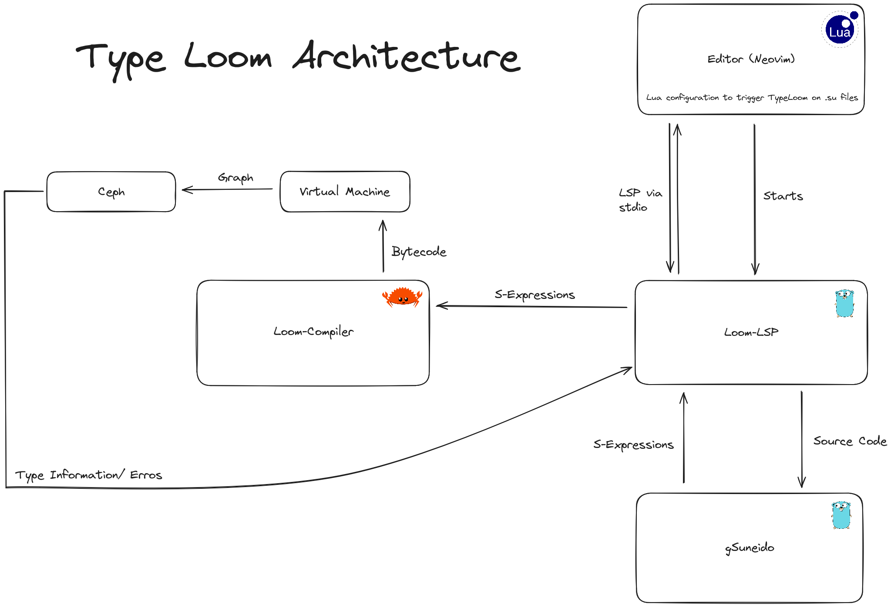

Ceph then performs type checking and basic inference on the graph data structure. Inference is the process of deducing the type of an
expression. If we are given the expression `message = "Hey mom!"`, we can infer that the type of the variable message is a string, or
when two numbers are being added we can be sure that the result is a number. Coming back to our graph, the nodes are connected to each
other by edges. A connection between two nodes indicates that the two nodes are related in some way. In our graph, when two nodes are
connected we say that that they have compatible types. `A <---> B` if nodes A and B are connected by an edge we put a type constraint
on them saying their types must be compatible or equal to each other. And this applies even if two nodes are not directly connected.
If `A <---> B` and `B <---> C` then `A <---> C`. A, B, and C are all nodes with compatible types in our graph. This fundamental property
of our graph is leevied by the inference engine to deduce the types of the nodes. 

For the function Add, this is what our graph would look like, 
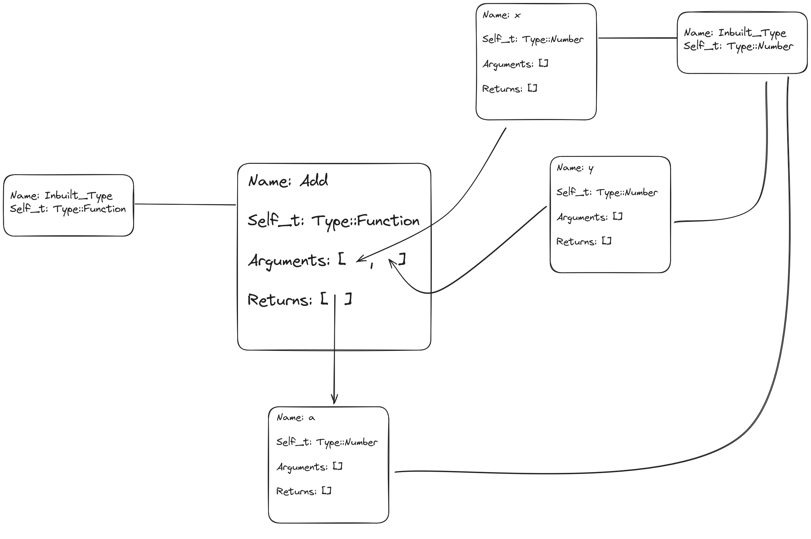
The above graph is missing the nodes that make up the Return(), Eq() and the actual Add or + operation.

Going, back to our previous Add example. We can infer the type of a to be a Number, if we know that x and y are Numbers. 
How would we know the type of x and y? Here, we say that since x and y are arguments to the function Add, the programmer must tell us 
explicity the signature of each function. That is, the programmer must define the type of each argument to functions and what they return. 
Many other type systems put a similar restriction for function signatures for type inference to work. If, the programmer had provided 
the signature of Add as `type Add >>= Fn(Number, Number) -> Number`, then we 
can infer the type of x and y to be Number. Ceph also checks for type errors. For each node, Ceph checks if the current node it is checking
for has a type that is compatible with the type of the node it is connected to. If the types are not compatible, Ceph raises a type error.
It also checks the signatures of the function provided by the programmer. Ceph when it comes across the node for Eq, would check that
all the arguments to it are compatible. For the Add node, it would check if the two arguments are Numbers and if it returns a Number.
And that is it, our type system is just two steps. The type system and the inference engine are illustrated by the following traits.

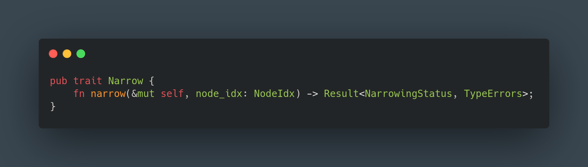
*Fig 8: This figure shows the type inference trait in Rust.*

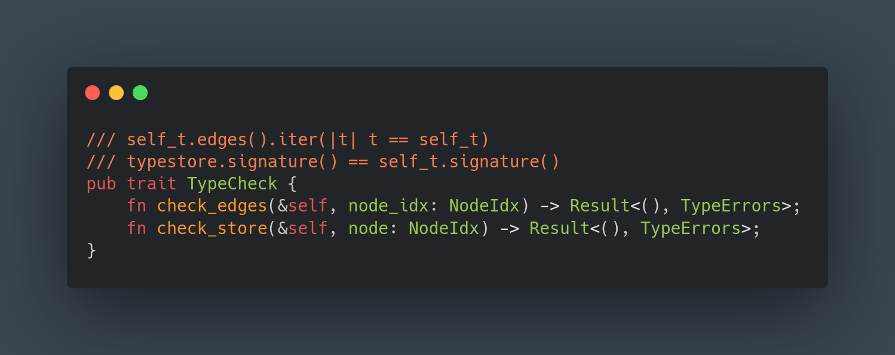
*Fig 9: This figure shows the type system trait in Rust.*

## Catching basic type errors

1. Basic Inference

First, we demonstrate how TypeLoom can use local (graph-based) inference to infer the types of the variables in a simple program.
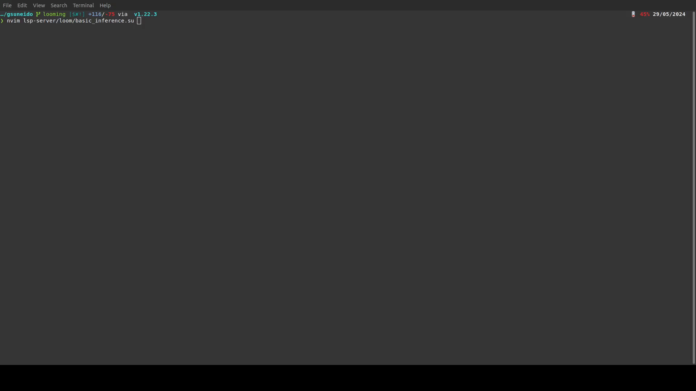

2. Catching Potential Bugs

In this example, the class has an attributen that isn't explicitly initialised, which could lead to potential bugs. TypeLoom catches this!

3. Catching Type Errors

Here, TypeLoom catches the error, where a number is being called as a function, which would otherwise throw a runtime error.
Also, note that it annotates the num variable as a Number which is inferred from the `+` operator.
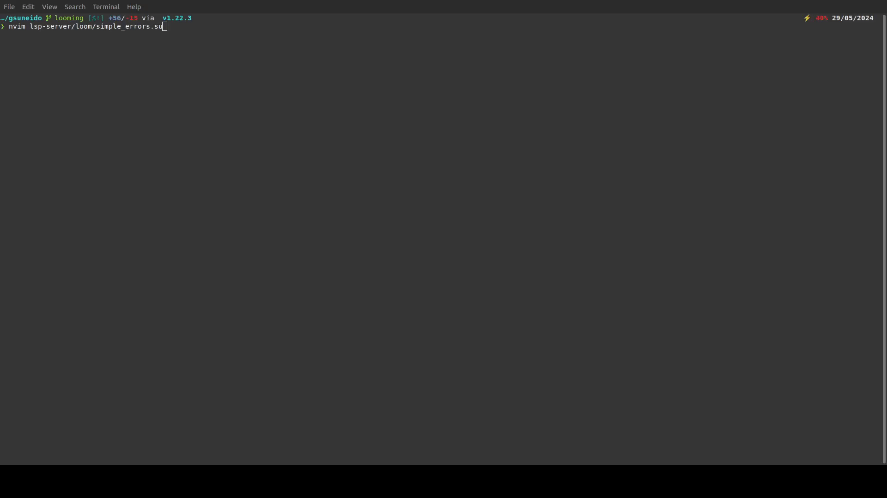

It can also catch a variable re-assignment. Here the variable `x` is first assigned as a String and then later a Number. TypeLoom 
catches this error as well.
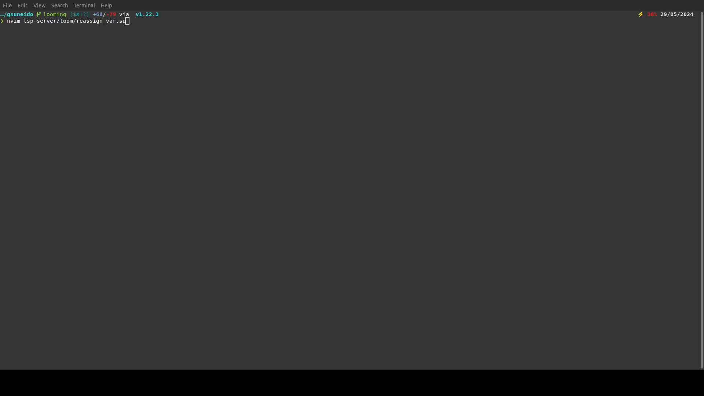

Here the programmer defined the argument to the function IncorrectParam as a Number as indicated by the inlay hints but then
within the function body it is being assigned a String. TypeLoom catches this error as a type mismatch.

## TypeLoom type system features

Previously, we demonstrated how TypeLoom can catch basic type errors. Now, we will show some advanced features of the TypeLoom type system.

1. Aliased Types
Types can be given new names for convinience. The type String for example could be aliased to Message and then a variable could be
of the type Message. This is a common feature in many type systems.

For the sake of simplicity we have aliased the type Number2 to Number, as you can see assigning a Number to Number2 is valid but not 
a string as indicated by the error.

2. Union Types
A variable can have multiple types. This is useful when a variable can be of multiple types. For example, a variable could be a Number
or a String. This is called a union type. A Union type is denoted by the `|` operator.

Here we have a type Currency which is a union of GBP, USD and CAD. A variable of type Currency can be assigned any of the three types,
and nothing else as demonstrated.
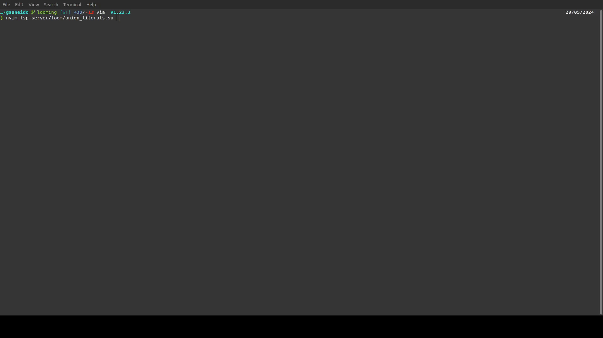

3. Structural Types
A structural type can be thought of as a key-value pair. A variable of a structural type must have the same keys as the type. This is
useful when a variable is expected to have a certain structure. For example, a variable could be expected to have a key `name` and a key
`age`. This is called a structural type. A structural type is denoted by the `:` operator.

Here we have two structural types User and Admin. GetUserAuth() only takes in the type Admin and not User. This is indicated by the error.

4. Runtime Guards
TypeLoom can understand runtime checks and guards to help it infer the type of variables.

Here even though x is defined as a String, when we add a Number to it, TypeLoom can infer that x is a Number. This is because the
previous if statement ensure that x will be of type Number. This is a powerful feature of the TypeLoom type system.

## Drawbacks

Currently, TypeLoom is quite limited and hasn't been tested extensively and is still a demo or a toy project in my opinion. 
The type system so far appears sound but it is possible that there are bugs in the implementation. The type system is may 
at first appear turing incomplete, but with the inference from runtime check it is possible that it turns out to be 
turing complete and undecidable. 

The type system is also quite basic and lacks many features that are present in modern type systems. For example, TypeLoom
does not support generics, higher kinded types, type classes, or dependent types. Not to say that advanced features are
a must but the aim of TypeLoom is to be a practical tool for developers to catch type errors in their codebase. 

The process of using code actions to take in developer input on type annotations hasn't been implemented yet. The bytecode
generation for the graph is not smart and there are some optimizations to be done there. And much thorough testing is required
but, TypeLoom as it currently stands is an excellent proof of concept, and holds great potential. 

